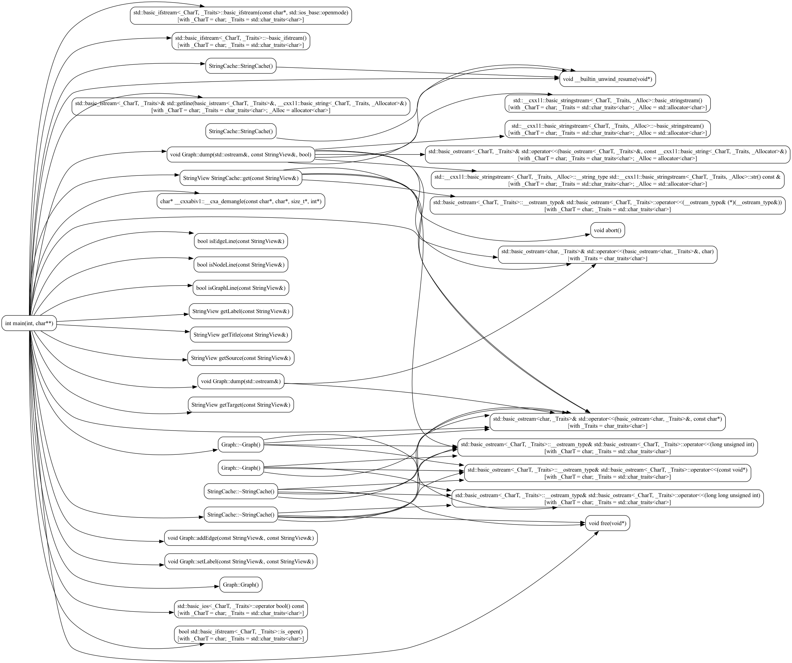

GCC Compiler Callgraph Aggregator

Aggregates the callgraph produced for each compilation unit by GCC into a
single DOT (https://graphviz.org/) file.

# Basics

GCC outputs <file>.ci containing the callgraph when runs with -fcallgraph-info.

```bash
gcc -fcallgraph-info=su,da -c source_file.c

# Generates:
#   source_file.o  - Object File
#   source_file.ci - Visualization of Compiler Graphs (VCG)
```

Using a build tool like CMAKE that extra compiler flag can be passed to call of
gcc using CXX\_FLAGS:

```bash
cmake -DCMAKE_CXX_FLAGS=-fcallgraph-info=su,da ..

# .ci files can be found beside .o files in <build_dir>/CMakeFiles directory.
```

# Build

```bash
mkdir -p build
cd build

cmake -DCMAKE_BUILD_TYPE=Release ..
```

# Usage

To generate an aggregate graph with everything call callgraph with all ci files:
```bash
./callgraph $(fd '.ci' build/CMakeFiles/callgraph.dir/src) > callgraph.dot
```

To reduce the callgraph to the nodes rooting from "main" use --root:
```bash
./callgraph --root=main $(fd '.ci' projects/cmake_example/build/CMakeFiles/cmake_example.dir/src) > example_main.dot
```

To reduce in the other direction, the nodes ending on "\_\_indirect\_call" use --leaf:
```bash
./callgraph --leaf=__indirect_call projects/example/main.ci > example_indcall.dot
```

By default translation unit locals like template function instantiation are
omitted because they greatly increase the number of nodes in the callgraph
and since the node names are so long it makes harder to read it.

To enable it use `-l` or `--show-translation-unit-local-entities` argument.

At the end, convert to one of the formats supported by dot:
```bash
dot -Tsvg input.dot > output.svg
```

Be aware that the larger the graph the longer it takes to convert.

## Example



There are 68 nodes and 59 edges in the picture above, if `-l` was used it would
increase to 689 nodes and 1284 edges which are too many to fit in a small picture.
